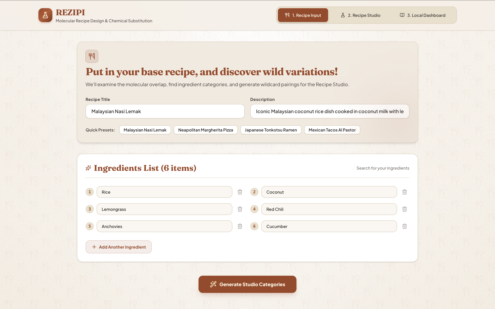
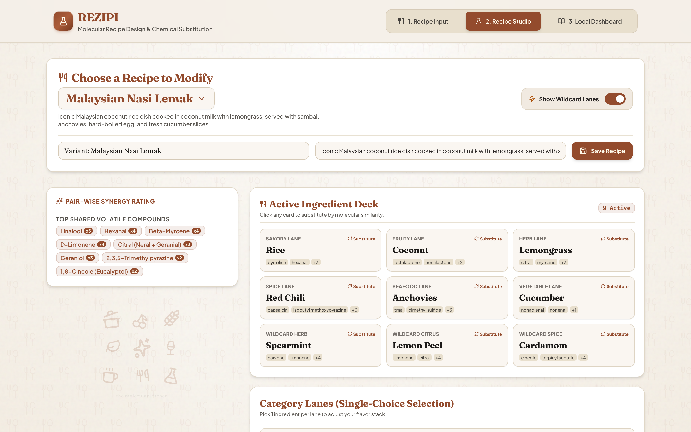
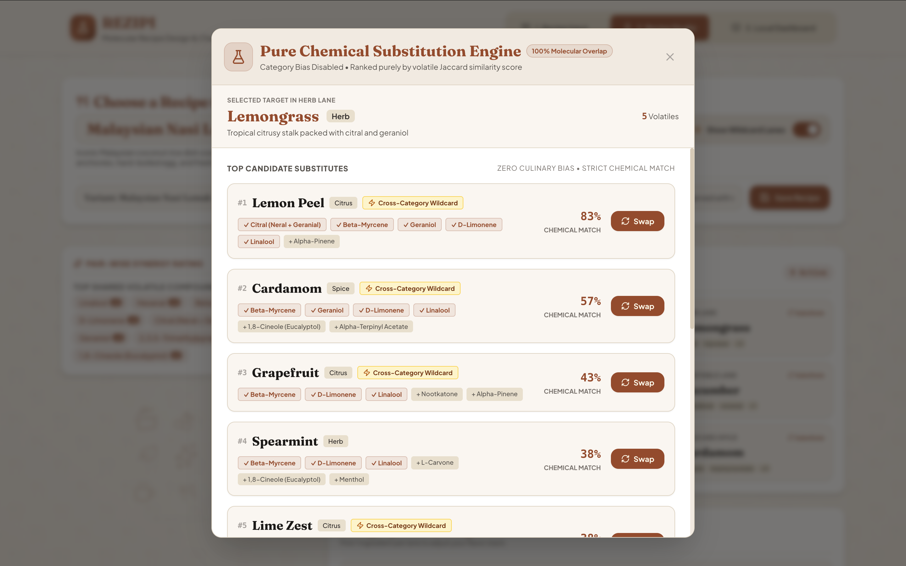

<div align="center">

# 🥘 REZIPI

### Molecular Recipe Design & Chemical Substitution

*Cook with chemistry, not just intuition.*


[https://zh-yng.github.io/rezipi/](https://zh-yng.github.io/rezipi/)

**A client-side data-science web app** that applies **set-similarity algorithms** (Jaccard index) over a **121-compound / 131-ingredient food-chemistry dataset** to recommend ingredient substitutions in real time.

Built with **React**, **TypeScript**, **Vite**, and **Tailwind CSS**, with **IndexedDB** (via **Dexie.js**) for persistent, offline-capable local storage — no backend server, database, or network round-trip required to compute a result.

`React` · `TypeScript` · `Vite` · `Tailwind CSS` · `IndexedDB` · `Dexie.js` · `Framer Motion` · `Data Structures & Algorithms` · `Jaccard Similarity` · `Set Theory` · `Client-Side Data Processing` · `Component-Driven Architecture` · `Custom Hooks` · `Responsive UI/UX Design`

</div>

<table>
<tr>
<!-- <td width="33%"></td> -->
<td width="50%"></td>
<td width="50%"></td>
</tr>
<tr>
<!-- <td align="center"><sub>Recipe Input</sub></td> -->
<td align="center"><sub>Recipe Studio</sub></td>
<td align="center"><sub>Substitution Engine</sub></td>
</tr>
</table>

## 🤔 Sound Familiar?

- 🛒 Can't find an ingredient for your recipe?
- 🔁 Tired of making the same dish over and over?
- 🌶️ Want to explore new flavor combinations, but don't know where to start?

**REZIPI has your back.** It's a recipe exploration tool that looks past the cutting board and into the *chemistry* of your food. Instead of substituting ingredients by culinary intuition alone, REZIPI analyzes the shared **volatile aromatic compounds** between ingredients and suggests alternatives ranked by molecular similarity — sprinkling in wildcard, cross-category pairings a chef might never think to try.

> 💡 **Put in your base recipe, and discover wild variations.** REZIPI examines the molecular overlap, finds ingredient categories, and generates wildcard pairings for the Recipe Studio.

## 📚 Table of Contents

- [About This Project](#-about-this-project)
- [Features](#-features)
- [How It Works](#-how-it-works)
- [Getting Started](#-getting-started)
- [Data Attribution](#-data-attribution)
- [Tech Stack](#%EF%B8%8F-tech-stack)
- [License](#-license)

## ✨ Features

<table>
<tr>
<td width="50%" valign="top">

### 🍽️ 1. Recipe Input
Enter a **Recipe Title** and **Description** for your base dish, then build out a full **Ingredients List**.

- ⚡ Jump-start with **Quick Presets**:
  - Malaysian Nasi Lemak
  - Neapolitan Margherita Pizza
  - Japanese Tonkotsu Ramen
  - Mexican Tacos Al Pastor
- ➕ Add as many ingredients as your recipe needs
- 🪄 Click **Generate Studio Categories** to send it to the Recipe Studio

</td>
<td width="50%" valign="top">

### ⚗️ 2. Recipe Studio
Your recipe's flavor chemistry, laid bare.

- **Pair-Wise Synergy Rating** — top shared volatile compounds across your ingredients (Linalool, Hexanal, Beta-Myrcene, D-Limonene, Citral, Geraniol, etc.)
- **Active Ingredient Deck** — ingredients sorted into flavor lanes: Savory · Fruity · Herb · Spice · Seafood · Vegetable
- **Wildcard Lanes** ⚡ — toggle on bonus lanes (Herb, Citrus, Spice) for unexpected chemical matches
- **Category Lanes** — lock in one ingredient per lane to build your variant

</td>
</tr>
<tr>
<td width="50%" valign="top">

### 🧪 3. Pure Chemical Substitution Engine
Click **Substitute** on any ingredient card to open it up:

- 📊 Ranks substitutes purely by **volatile Jaccard similarity score** — zero culinary bias
- 🎯 Shows a **Chemical Match %** with the exact shared compounds
- 🃏 Flags **Cross-Category Wildcards** — high-similarity substitutes from a totally different category (e.g. Lemongrass → Cardamom or Grapefruit)
- 🔄 One-click **Swap** to apply it to your active recipe

</td>
<td width="50%" valign="top">

### 📖 4. Local Dashboard
Your personal cookbook of chemistry.

- Browse every recipe and variant you've created
- Revisit past experiments
- Manage everything saved locally

</td>
</tr>
</table>

## 🧠 How It Works

```
🌿 Ingredient  →  🧬 Volatile Compound Set  →  📐 Similarity Score  →  🔄 Ranked Substitutes
```

REZIPI models each ingredient as a set of **volatile aromatic compounds** (e.g. limonene, linalool, myrcene, citral). When you ask for a substitute, it computes a similarity score — like a **Jaccard index** — between the target ingredient's compound set and every candidate in its database.

The result: a ranked list of substitutes based purely on chemistry — which is exactly why unconventional matches (citrus standing in for an herb, a spice standing in for citrus) can outrank the "obvious" culinary swap. 🍋 ↔️ 🌿

## 🚀 Getting Started

| Step | Action |
|:---:|---|
| 1️⃣ | Head to **Recipe Input** — enter a title, description, and ingredients (or grab a Quick Preset) |
| 2️⃣ | Click **Generate Studio Categories** to move into the Recipe Studio |
| 3️⃣ | In **Recipe Studio**, review the Synergy Rating and Ingredient Deck — toggle **Wildcard Lanes** for bonus categories |
| 4️⃣ | Click **Substitute** on any card to open the Chemical Substitution Engine and find your match |
| 5️⃣ | **Save** your variant, then find it anytime in the **Local Dashboard** |

## 📊 Data Attribution

This project uses data from **[FlavorDB](https://cosylab.iiitd.edu.in/flavordb2/)**, developed by the Computational Biology Group at **IIIT-Delhi**.

The dataset is used under the **Creative Commons Attribution-NonCommercial-ShareAlike 3.0 Unported (CC BY-NC-SA 3.0)** license.

## 🛠️ Tech Stack

| Layer | Technology | Purpose |
|---|---|---|
| **Framework** | [React](https://react.dev/) | Component-based SPA with three primary views (Recipe Input, Recipe Studio, Local Dashboard) |
| **Language** | [TypeScript](https://www.typescriptlang.org/) | End-to-end type safety across the domain model, math layer, and UI |
| **Build Tool** | [Vite](https://vitejs.dev/) | Dev server, HMR, and production bundling |
| **Styling** | [Tailwind CSS](https://tailwindcss.com/) + `tailwind-merge` + `clsx` | Utility-first design system with a custom CSS-variable theme |
| **Animation** | [Motion (Framer Motion)](https://motion.dev/) | Page transitions and micro-interactions |
| **Local Persistence** | [Dexie.js](https://dexie.org/) (IndexedDB wrapper) + `dexie-react-hooks` | Client-side, offline-capable storage for recipes and saved variants — no backend database |
| **Iconography** | [Lucide React](https://lucide.dev/) | Icon set |
| **UI Extras** | `canvas-confetti` | Celebratory UI feedback |
| **Tooling** | `tsc` (type-checking), ESLint-adjacent tsconfig, npm | Static analysis and lint step (`npm run lint`) |

**Core algorithms** (implemented from scratch in `src/lib/math/`):
- **`similarity.ts`** — Jaccard similarity coefficient `J(A,B) = |A ∩ B| / |A ∪ B|` between ingredient compound sets
- **`synergy.ts`** — pair-wise aggregate synergy scoring across a full recipe's ingredient list
- **`substitution.ts`** — ranks candidate substitutes by molecular overlap, independent of culinary category
- **`clustering.ts`** — ensures each flavor "lane" has a minimum viable set of ingredient options, backfilling by category proximity

**Data layer** (`src/lib/flavordb/`, `src/data/flavordb.json`): a locally-bundled dataset of **131 ingredients** and **121 volatile compounds**, sourced from FlavorDB (see [Data Attribution](#-data-attribution)) and queried through a typed access layer (`src/types/flavordb.ts`).

## 📄 License

The REZIPI codebase is licensed under the **[MIT License](LICENSE)**.

> ⚠️ Note: The MIT license applies to the REZIPI project code only. Flavor/compound data sourced from FlavorDB remains subject to the **CC BY-NC-SA 3.0** license described above.

<div align="center">

Made for anyone who's ever stared into the fridge and thought *"what if I swapped this for chemistry instead?"* 🧪🍳

</div>
